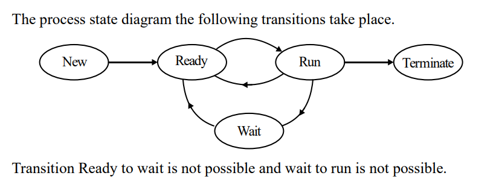
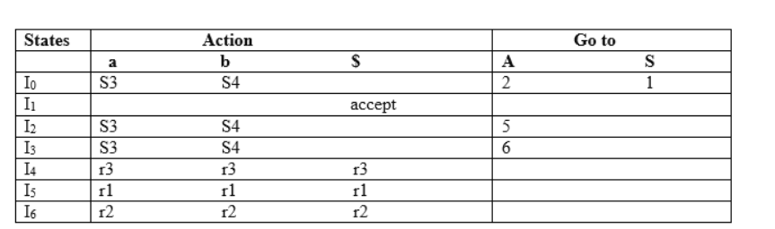

### Notes

1. Product of eigen values = determinate of the matrix [EM] [LA]
2. Process State Transition Diagram  [OS]
3. In a B+ Tree, Only for Root node (50%) node occupancy is relaxed. A Degree(t) is set for a B+ Tree, to help understand the structure of the tree and number of Keys within a Node.
   - **Maximum number of Keys = 2t-1**
   - **Minimum number of Keys = t-1** [DBMS]
4. Parser := Used by compilers/interpreters to understand a language grammer (CFG). 2 types

   - TOP DOWN PARSER = LL (Left to Right and Leftmost Derivative)
   - BOTTOM UP PARSER = LR (Left to Right and Rightmost Derivative) and Operator Precedence are types of **Shift-Reduce Parser**

   LL parsers are simple = had to observer lookahead token which is ( the k in LL(k) is lookahead token )
   for lookahead token 1, LL(1) just have to input (eg. "int + int") one at a time with the grammer `E  → T E'`

   ```
       E  → T E'
       E' → + T E' | ε
       T  → int
   ```

   LR Parsers are difficult = Hard but I'm sure you will get it tani (the tani in past was able to figure it out!!)
   (this is good guide https://javatpoint.com/lr-parser , but remember that you did it in rough notebook with mr sahaj in the chai shop)

   In short, this is parse table. Your task is to get here just from the grammer using DFA , remember to take a fake grammer `E' -> E` indicating termination step (Accept). In the table, "Accept" should be lonely in a row :((, no shifts no reduce.
   Reduce are rules from the grammer.
   

5. skip
6.
